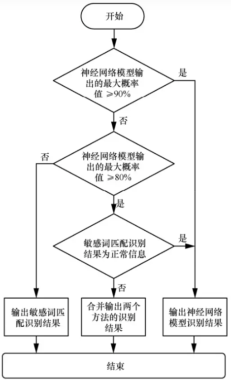

### text security detection 文本内容安全检测

-----------------------------------------------------------------------
互联网和移动互联网中的信息内容急速膨胀，导致其中充斥着违法违规和不良信息，影响互联网空间的内容安全。基于敏感词匹配的传统文本内容安全识别方法忽略上下文语义，导致误报率高、准确率低。在分析传统文本内容安全识别方法的基础上，提出了利用深度学习的融合识别模型以及模型融合算法流程。
所提模型可以有效解决传统识别方法缺乏语义理解造成误报率高的问题，提高了不良信息检测的准确性。

The rapid expansion of information content in the Internet and mobile Internet leads to illegal and bad information, which affects the content security of the Internet space. Traditional text content security recognition methods based on sensitive word matching ignore the context semantics, resulting in high false positive rate and low accuracy. Based on the analysis of traditional text content security recognition methods, the fusion recognition model and the algorithm flow of model fusion based on deep learning are proposed. The proposed model can effectively solve the problem of high false positive rate caused by the lack of semantic understanding in traditional recognition methods, and improve the accuracy of bad information detection.

本项目采用java实现。

text_security_detection支持以下方法：

* 辱骂和攻击(offensive_text_detection)

* 敏感词(sensitivity_word_detection，敏感词部分自己添加到resources/sensitive_words/sensitive_data.txt中)

* 广告(advertising_text_detection)

--------------------------------------------------------------------------------
### the overall processing process of text security detection 文本内容安全检测流程

<div align=center>
<br/>
</div>

### usage
【src/main/java/com/sy/MainTest】

``` java
        public class MainTest {
            public static void main(String...args) {
                var testInput = "一，凡是未开工的违规项目，一律不得开工建设；二，凡是不符合产业政策、准入标准、环保要求的违规项目一律停建。";
                testInput = "草你妈的，什么傻逼玩意！";
                var textDetectionMain = new TextDetectionMain();
                try {
                    ResultV1 result = textDetectionMain.detectionV1(testInput);
                    System.out.println(JSON.toJSONString(result));
                } catch (Exception e) {
                    e.printStackTrace();
                }
        
                System.out.println("========================================");
                try {
                    ResultV2 result = textDetectionMain.detectionV2(testInput);
                    System.out.println(JSON.toJSONString(result));
                } catch (Exception e) {
                    e.printStackTrace();
                }
            }
        }


result:

{"advertisingTextDetPro":0.43111621001528977,"htmlHighlightWords":"一，凡是未开工的违规项目，一律不得开工建设；二，凡是不符合产业政策、准入标准、环保要求的违规项目一律停建。","isSpam":false,"offensiveTextDetPro":0.4379274282007758,"sensitiveWordResultList":[]}
========================================
{"isSpam":false,"offensiveTextDetPro":0.4379274282007758}


{"advertisingTextDetPro":0.994104908809618,"htmlHighlightWords":"<font color='red'>草你妈</font>的，什么<font color='red'>傻逼</font>玩意！","isSpam":true,"offensiveTextDetPro":0.69725142123181,"sensitiveWordResultList":[{"positions":[{"endPosition":2,"startPosition":0}],"word":"草你"},{"positions":[{"endPosition":3,"startPosition":0}],"word":"草你妈"},{"positions":[{"endPosition":3,"startPosition":1}],"word":"你妈"},{"positions":[{"endPosition":4,"startPosition":1}],"word":"你妈的"},{"positions":[{"endPosition":4,"startPosition":2}],"word":"妈的"},{"positions":[{"endPosition":9,"startPosition":7}],"word":"傻逼"},{"positions":[{"endPosition":11,"startPosition":8}],"word":"逼玩意"}]}
========================================
{"htmlHighlightWords":"<font color='red'>草你妈</font>的，什么<font color='red'>傻逼</font>玩意！","isSpam":true,"offensiveTextDetPro":0.69725142123181,"sensitiveWordResultList":[{"positions":[{"endPosition":2,"startPosition":0}],"word":"草你"},{"positions":[{"endPosition":3,"startPosition":0}],"word":"草你妈"},{"positions":[{"endPosition":3,"startPosition":1}],"word":"你妈"},{"positions":[{"endPosition":4,"startPosition":1}],"word":"你妈的"},{"positions":[{"endPosition":4,"startPosition":2}],"word":"妈的"},{"positions":[{"endPosition":9,"startPosition":7}],"word":"傻逼"},{"positions":[{"endPosition":11,"startPosition":8}],"word":"逼玩意"}]}
```

### requirement
java11+

### contact
- github：https://github.com/jiangnanboy

### reference
- https://github.com/hailin0/sensitive-word-filter
- https://github.com/jiangnanboy/java_textcnn_onnx
- https://github.com/jiangnanboy/llm_corpus_quality
- https://github.com/jiangnanboy/ad_detection
- https://github.com/LL4J/Filter4J

